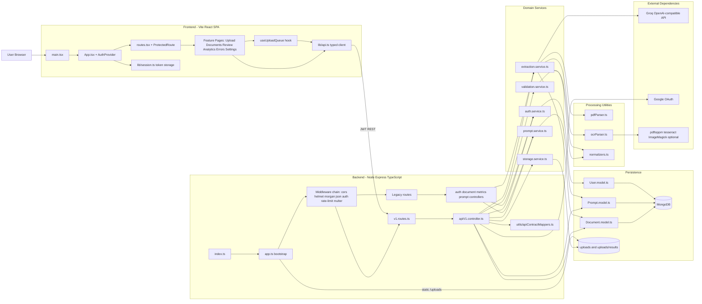
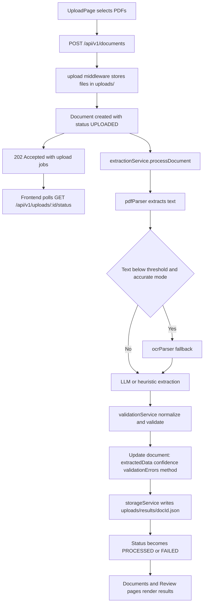

# Docfish Architecture Overview

## Scope
This document summarizes the current architecture of the Docfish workspace, including the React frontend, Express API backend, persistence, and external integrations.

## Detailed Architecture Diagram

## Detailed Processing Pipeline

## Key Architectural Characteristics
- Asynchronous ingestion: Non-blocking upload contract with polling-based status updates.
- Graceful degradation: Heuristic and OCR fallback paths prevent hard failure when model or parsing quality is limited.
- Contract-driven API: Centralized API v1 routes with mappers translating internal models to frontend contract objects.
- Modular backend services: Auth, extraction, validation, storage, and prompt workflows are separated by responsibility.
